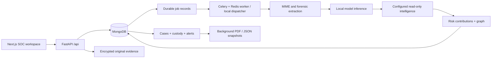

# MailTrace AI

An evidence-backed email investigation platform for the supplied SIH 26106 requirements. Upload RFC/MIME emails or CSV records, preserve original bytes, run forensics and local ML inference, enrich observed indicators with configured providers, investigate infrastructure, and export a case report.

The production application has no sample records, mock authentication, fabricated intelligence, or fallback dashboard statistics. Missing providers return **Not Configured**; missing models return **Model unavailable**. A low risk score is not a claim of safety.

The default enrichment stack is local Python forensics/DNS/DKIM/GeoLite2 plus optional VirusTotal and AbuseIPDB. URLScan and GreyNoise are retained only as optional legacy adapters. See [local-stack changes, checks and commands](docs/LOCAL_STACK.md).

See the [delivery reference](docs/DELIVERY.md) for the requested 20-item implementation summary.

## Architecture



The existing `app/` frontend directory is retained. `backend/app/main.py` is the supported API; `backend/main.py` remains a compatible Uvicorn entry point. The prototype is archived under `legacy/` and is not deployed. Production defaults to a fresh `mailtrace_enterprise` database, preserving the old `mailtrace_ai` database without presenting seeded records as real investigations.

## Local installation

Use Python 3.12+ and Node.js 22+. MongoDB must be running on localhost or configured through `MONGODB_URI`.

```bash
python3 -m venv backend/venv
backend/venv/bin/python -m pip install -r backend/requirements.txt
cd app
npm ci
cd ..
backend/venv/bin/python scripts/setup.py --create-admin --admin-email admin@your-domain.com
```

Setup generates random secrets in a private root `.env`. It does not overwrite an existing configuration or administrator. The initial password is written only to `data/bootstrap-admin.txt` (mode 0600). Sign in and change it through **Account security**, then remove the bootstrap credential file when no longer needed. This file is excluded from Git.

Start the API and frontend in separate terminals:

```bash
backend/venv/bin/python -m uvicorn app.main:app --app-dir backend --host 127.0.0.1 --port 8000 --no-access-log
```

```bash
cd app
BACKEND_URL=http://127.0.0.1:8000 npm run dev
```

Open http://localhost:3000. API documentation is at http://localhost:8000/docs. The browser uses same-origin `/api` requests proxied by Next.js. Tokens are HttpOnly cookies, mutations require a CSRF header, and logout revokes the persisted session.

`WORKER_MODE=local` uses a bounded background dispatcher that claims persisted MongoDB jobs. It requires no Redis and is suitable for local development. For durable multi-process deployments use `WORKER_MODE=celery`, configure Redis, and run:

```bash
cd backend
venv/bin/celery -A app.workers.celery_app:celery worker --beat --loglevel=INFO --concurrency=2 --schedule=../data/celerybeat-schedule
```

Actual processing stages are recorded in MongoDB. Failed jobs preserve evidence and can be retried explicitly. An expired worker lease is marked failed rather than displaying fabricated progress. Run only one Celery beat scheduler.

## Docker deployment

```bash
backend/venv/bin/python scripts/setup.py
docker compose up --build -d
docker compose exec backend python /srv/scripts/setup.py --create-admin --admin-email admin@your-domain.com
docker compose exec backend cat /srv/data/bootstrap-admin.txt
```

The stack includes frontend, backend, MongoDB, Redis and Celery worker/beat. MongoDB and Redis have credentials and are not published to host ports; the frontend binds to localhost:3000. Evidence uses a persistent volume, shared between API and worker. Artifacts are mounted read-only from `ml/artifacts`.

For a deployment outside localhost, place an HTTPS reverse proxy in front of the frontend, set `COOKIE_SECURE=true`, configure the exact `CORS_ORIGINS` and Gmail redirect URI, and protect/backup `.env`, the evidence encryption key, MongoDB, and the evidence volume. Do not rotate the encryption key without re-encrypting existing data. MongoDB stores derived email content; use encrypted disks/backups and database access controls. Normal application users cannot mutate audit entries, but this is not WORM storage or protection from a database administrator.

The default Docker image supports the selected TF-IDF baseline. To serve any of the neural candidates, run `INSTALL_DEEP=true docker compose build backend worker` and restart those services before selecting the artifact in Settings. This includes the optional PyTorch/Transformers dependencies.

## ML and datasets

The source datasets are private local inputs in `MailTrace-AI Dataset/`, excluded from Git. Training never inserts corpus rows into the production database.

```bash
backend/venv/bin/python ml/prepare.py --root 'MailTrace-AI Dataset' --enron-limit 10000
backend/venv/bin/python ml/train.py --out ml/artifacts/baseline
backend/venv/bin/python -m pip install -r ml/requirements-deep.txt
backend/venv/bin/python ml/train_deep.py --model cnn --epochs 3 --out ml/artifacts/cnn --batch-size 32
backend/venv/bin/python ml/train_deep.py --model bilstm --epochs 3 --out ml/artifacts/bilstm --batch-size 32
backend/venv/bin/python ml/train_deep.py --model transformer --pretrained prajjwal1/bert-tiny --epochs 3 --out ml/artifacts/transformer --batch-size 32
backend/venv/bin/python ml/select_model.py ml/artifacts/baseline ml/artifacts/cnn ml/artifacts/bilstm ml/artifacts/transformer
```

The baseline is TF-IDF + class-balanced logistic regression. Neural candidates implement multi-kernel CNN, bidirectional LSTM, and fine-tuning of pretrained BERT/DistilBERT-compatible checkpoints. Long neural inputs are chunked and probabilities averaged at inference. Vocabulary fitting and training use only the training split. Hyperparameters/epochs are selected on validation macro-F1; test data is used only for final reporting. An ensemble is optional and has not been introduced.

Artifacts contain weights, tokenization configuration, label mappings, dataset version, validation and test metrics, and limitations. Local model loading is separate from business logic; it returns only computed probabilities. Model metadata changes are detected by API and worker processes. Only deploy trusted artifacts: Python joblib is executable serialization and must not accept user uploads.

See [measured model comparison](docs/MODELS.md) for results from all four trained candidates. See [dataset documentation](docs/DATASETS.md) for actual corpus counts, mapping decisions, leakage controls, and limitations. Source-specific/synthetic artifacts can inflate within-corpus scores; these are not enterprise deployment accuracy claims.

## Integrations and configuration

| Variable | Purpose |
|---|---|
| `MONGODB_URI`, `MONGODB_DB_NAME` | Database connection and isolated application database |
| `REDIS_URL`, `WORKER_MODE` | Celery broker and background-processing mode |
| `JWT_SECRET`, `JWT_EXPIRE_MINUTES` | Session signing and lifetime; secret must be at least 32 characters |
| `EVIDENCE_ENCRYPTION_KEY` | Fernet key for evidence, reports, provider keys and Gmail tokens |
| `DATA_DIR`, `MODEL_DIR` | Optional absolute storage and trusted artifact paths |
| `COOKIE_SECURE`, `CORS_ORIGINS` | HTTPS cookie policy and exact frontend origins |
| `VIRUSTOTAL_API_KEY` | Existing IP/domain/URL/file-hash reports |
| `ABUSEIPDB_API_KEY` | Public-IP abuse reports |
| `URLSCAN_API_KEY` | Optional legacy adapter only; not needed for URL analysis |
| `GREYNOISE_API_KEY` | Optional legacy adapter only |
| `GEOIP_LICENSE_KEY` | Legacy setting; local GeoIP does not require an API key |
| `GEOIP_CITY_DB`, `GEOIP_ASN_DB` | Local MaxMind City and/or ASN database paths |
| `GOOGLE_CLIENT_ID`, `GOOGLE_CLIENT_SECRET`, `GOOGLE_REDIRECT_URI` | Optional Gmail read-only OAuth import |
| `BACKEND_URL` | Frontend server proxy destination |

Provider credentials can also be saved through administrator settings; they are encrypted and never returned to the browser. Each provider can be disabled independently. Results include source, time, status and raw provider evidence, with a six-hour success cache. Failed/rate-limited providers are isolated. DNS and automatic external enrichment are disabled by default. The DNS setting enables DNS policy inspection and real RSA-SHA256 DKIM verification. Local GeoIP runs independently of the external-enrichment toggle and supports City-only or ASN-only configuration. Enabling external enrichment discloses extracted indicators to configured providers; message bodies and attachments are not submitted. Lookups do not follow suspect URLs.

Local GeoIP works without per-query disclosure. Map tiles come from OpenStreetMap, which receives normal map tile requests. Location estimates represent infrastructure, not a human attacker. WHOIS/registration fields are shown only when returned by a configured provider.

## Investigation workflow

1. Ingest `.eml`, `.mime`, pasted RFC email, or UTF-8 CSV. CSV accepts `raw_email` or body/text/message plus subject, sender, receiver and reply_to. Original CSV and each derived message have separate hashes and an explicit source relationship.
2. Follow real processing stages. Review model probabilities separately from forensic and provider findings.
3. Explore complete headers, reported authentication, sender identity, links, attachments, relay candidates, network locations, and the infrastructure graph.
4. Create a case or attach to an existing case. Add notes, assign a senior-reviewed investigation, and record status changes.
5. Verify original bytes in the evidence vault. Generate background PDF and JSON case snapshots with 26 sections, custody history and evidence hashes.

The dashboard is aggregated from MongoDB. Empty databases show empty states. Lists and search are bounded and paginated. Analysts can ingest, investigate, annotate and report. Senior analysts can reassign/resolve/close investigations and associate campaigns. Administrators manage users, secrets, masking, risk configuration, retention and audit access.

## API, routes and data model

See [implementation reference](docs/IMPLEMENTATION.md) for collections, endpoint groups, routes, migration decisions and concrete remaining limits. `/docs` and `/openapi.json` are generated from the actual Pydantic API.

## Forensic and privacy limits

Authentication-Results are preserved as reported assertions. The application performs local RSA-SHA256 DKIM verification over the preserved bytes when DNS is enabled, bounded to five signatures. DNS failures and unsupported algorithms remain unavailable. SPF policies are inspected, but uploaded headers cannot establish a trusted SMTP peer/envelope, so fresh SPF authorization stays unknown. DMARC can pass through aligned, independently verified DKIM and a valid current DNS policy; a DMARC failure is not invented when SPF remains unknown. An earliest observed public relay is only a candidate; without a trustworthy receiving boundary, origin remains unknown.

Suspicious attachment types are not malware verdicts. Geolocation is approximate; cloud/proxy/VPN/TOR nodes may be intermediaries. Provider results and shared indicators do not establish a human identity or common ownership. Campaign grouping requires analyst rationale; automatic suggestions require multiple shared strong indicators.

Masking is configurable for analyst views, with original downloads restricted under that policy. Retention is opt-in; case-linked evidence and analyses are held. Redis/Celery beat applies configured retention hourly; local mode supports an administrator-triggered run. No active/intrusive investigation or automatic URL execution is performed.

See [scoring and missing-location correction](docs/SCORING_FIX.md) for version 2.0 correlation rules, regression results, and the difference between model probability, risk score, and unavailable location evidence.
