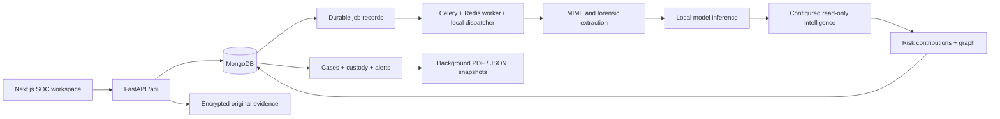

# MailTrace AI

An evidence-backed email investigation platform for the supplied SIH 26106 requirements. Upload RFC/MIME emails or CSV records, preserve original bytes, run forensics and local ML inference, enrich observed indicators with configured providers, investigate infrastructure, and export a case report.

The production application has no sample records, mock authentication, fabricated intelligence, or fallback dashboard statistics. Missing providers return **Not Configured**; missing models return **Model unavailable**. A low risk score is not a claim of safety.

The default enrichment stack is local Python forensics/DNS/DKIM/GeoLite2 plus optional VirusTotal and AbuseIPDB. URLScan and GreyNoise are retained only as optional legacy adapters. See [local-stack changes, checks and commands](docs/LOCAL_STACK.md).

See the [SIH 26106 requirement mapping](docs/SIH_FEATURE_MAPPING.md) for implemented features, conditional integrations and remaining deployment gaps, and the [completion update](docs/SIH_COMPLETION.md) for the latest fixes and validation. The [delivery reference](docs/DELIVERY.md) describes the earlier implementation summary.

## Architecture


```mermaid
flowchart LR
  UI[Next.js SOC workspace] --> API[FastAPI /api]
  API --> DB[(MongoDB)]
  API --> E[Encrypted original evidence]
  DB --> Jobs[Durable job records]
  Jobs --> W[Celery + Redis worker / local dispatcher]
  W --> F[MIME and forensic extraction]
  F --> ML[Local model inference]
  ML --> TI[Configured read-only intelligence]
  TI --> R[Risk contributions + graph]
  R --> DB
  DB --> C[Cases + custody + alerts]
  C --> Reports[Background PDF / JSON snapshots]
```

The existing Next.js App Router application is retained under `app/src/app`. `backend.main:app` is the API entry point; run Python commands from the repository root. Training tools are isolated under `ml/`; production inference and shared neural architectures live under `backend/detection/`. No training package is imported by inference.

```text
MailTrace-AI/
├── app/                       # Next.js frontend
│   ├── src/
│   │   ├── app/               # App Router pages, layouts and styles
│   │   ├── components/        # Investigation UI, maps and graphs
│   │   ├── hooks/             # Shared data-loading hook
│   │   ├── services/          # API client and CSRF handling
│   │   └── types/             # Shared frontend types
│   ├── public/
│   └── tests/                 # Frontend regression tests
├── backend/
│   ├── main.py                # FastAPI lifecycle and middleware
│   ├── config.py              # Repository-relative runtime paths
│   ├── api/routes/            # Feature-specific endpoints
│   ├── core/                  # Pipeline, risk, correlation and security
│   ├── database/              # MongoDB, encrypted evidence and settings
│   ├── detection/             # Production model loading and inference
│   ├── forensics/             # Authentication verification
│   ├── parsers/               # MIME, headers, URLs and attachments
│   ├── intelligence/          # GeoIP, DNS and reputation providers
│   ├── integrations/          # Mailbox monitoring
│   ├── reporting/             # Evidence snapshots and PDF rendering
│   ├── schemas/               # API request validation
│   └── workers/               # Celery dispatch and maintenance
├── ml/
│   ├── preprocessing/         # Corpus normalization and splitting
│   ├── training/              # Baseline and neural training
│   ├── evaluation/            # Metrics, selection and PPT exports
│   └── artifacts/             # Existing trained models (local only)
├── data/
│   ├── datasets/{raw,splits}/ # Private corpora and frozen splits
│   └── geoip/                 # MaxMind database bundles
├── storage/                   # Private writable runtime files
│   ├── evidence/              # Encrypted original messages
│   ├── reports/               # Encrypted case reports
│   └── exports/               # Generated validation deliverables
├── tests/{unit,integration,fixtures}/
├── scripts/                   # Setup and isolated integration runner
├── .github/workflows/         # Backend tests and frontend build checks
├── docker/                    # Images and MongoDB initialization
├── docs/                      # Architecture, checks and limitations
├── docker-compose.yml
└── pyproject.toml             # Python package and test configuration
```

Private datasets, model binaries, GeoIP files, evidence, reports, secrets and caches are excluded from Git and image build contexts. The [refactoring manifest](docs/REFACTORING.md) records moved files and compatibility decisions. Existing MongoDB evidence records using the old `data/` prefix remain readable through a constrained path translation; their records and encrypted bytes are preserved.

## Local installation

Use Python 3.12+ and Node.js 22+. MongoDB must be running on localhost or configured through `MONGODB_URI`.

```bash
python3 -m venv backend/venv
backend/venv/bin/python -m pip install -r backend/requirements.txt
cd app
npm ci
cd ..
backend/venv/bin/python scripts/setup.py --create-admin --admin-email admin@your-domain.com
```

Setup generates random secrets in a private root `.env`. It does not overwrite an existing configuration or administrator. The initial password is written only to `storage/bootstrap-admin.txt` (mode 0600). Sign in and change it through **Account security**, then remove the bootstrap credential file when no longer needed. This file is excluded from Git.

Start the API and frontend in separate terminals:

```bash
backend/venv/bin/python -m uvicorn backend.main:app --host 127.0.0.1 --port 8000 --no-access-log
```

The existing development command also works from inside `backend/` with its virtual environment activated:

```bash
uvicorn main:app --reload
```

```bash
cd app
BACKEND_URL=http://127.0.0.1:8000 npm run dev
```

Open http://localhost:3000. API documentation is at http://localhost:8000/docs. The browser uses same-origin `/api` requests proxied by Next.js. Tokens are HttpOnly cookies, mutations require a CSRF header, and logout revokes the persisted session.

`WORKER_MODE=local` uses a bounded background dispatcher that claims persisted MongoDB jobs. It requires no Redis and is suitable for local development. For durable multi-process deployments use `WORKER_MODE=celery`, configure Redis, and run:

```bash
backend/venv/bin/celery -A backend.workers.celery_app:celery worker --beat --loglevel=INFO --concurrency=2 --schedule=storage/celerybeat-schedule
```

Actual processing stages are recorded in MongoDB. Failed jobs preserve evidence and can be retried explicitly. An expired worker lease is marked failed rather than displaying fabricated progress. Run only one Celery beat scheduler.

## Docker deployment

```bash
backend/venv/bin/python scripts/setup.py
docker compose up --build -d
docker compose exec backend python /srv/scripts/setup.py --create-admin --admin-email admin@your-domain.com
docker compose exec backend cat /srv/storage/bootstrap-admin.txt
```

The stack includes frontend, backend, MongoDB, Redis and Celery worker/beat. MongoDB and Redis have credentials and are not published to host ports; the frontend binds to localhost:3000. Evidence uses a persistent volume, shared between API and worker. Artifacts are mounted read-only from `ml/artifacts`; GeoIP databases are mounted read-only from `data/geoip`. The existing named evidence volume is retained, now mounted at `/srv/storage`. Set `DOCKER_GEOIP_CITY_DB` and `DOCKER_GEOIP_ASN_DB` to the container paths inside dated bundles, or put the two `.mmdb` files directly in `data/geoip`.

For a deployment outside localhost, place an HTTPS reverse proxy in front of the frontend, set `COOKIE_SECURE=true`, configure the exact `CORS_ORIGINS` and Gmail redirect URI, and protect/backup `.env`, the evidence encryption key, MongoDB, and the evidence volume. Do not rotate the encryption key without re-encrypting existing data. MongoDB stores derived email content; use encrypted disks/backups and database access controls. Normal application users cannot mutate audit entries, but this is not WORM storage or protection from a database administrator.

The default Docker image supports the selected TF-IDF baseline. To serve any of the neural candidates, run `INSTALL_DEEP=true docker compose build backend worker` and restart those services before selecting the artifact in Settings. This includes the optional PyTorch/Transformers dependencies.

## ML and datasets

The source datasets are private local inputs in `data/datasets/raw/`, excluded from Git. Training never inserts corpus rows into the production database.

```bash
backend/venv/bin/python ml/preprocessing/dataset_builder.py --root 'data/datasets/raw' --enron-limit 10000
backend/venv/bin/python ml/training/train_baseline.py --out ml/artifacts/baseline
backend/venv/bin/python -m pip install -r ml/requirements-deep.txt
backend/venv/bin/python ml/training/train_deep.py --model cnn --epochs 3 --out ml/artifacts/cnn --batch-size 32
backend/venv/bin/python ml/training/train_deep.py --model bilstm --epochs 3 --out ml/artifacts/bilstm --batch-size 32
backend/venv/bin/python ml/training/train_deep.py --model transformer --pretrained prajjwal1/bert-tiny --epochs 3 --out ml/artifacts/transformer --batch-size 32
backend/venv/bin/python ml/evaluation/select_model.py ml/artifacts/baseline ml/artifacts/cnn ml/artifacts/bilstm ml/artifacts/transformer
```

The baseline is TF-IDF + class-balanced logistic regression. Neural candidates implement multi-kernel CNN, bidirectional LSTM, and fine-tuning of pretrained BERT/DistilBERT-compatible checkpoints. Long neural inputs are chunked and probabilities averaged at inference. Vocabulary fitting and training use only the training split. Hyperparameters/epochs are selected on validation macro-F1; test data is used only for final reporting. An ensemble is optional and has not been introduced.

Artifacts contain weights, tokenization configuration, label mappings, dataset version, validation and test metrics, and limitations. Local model loading is separate from business logic; it returns only computed probabilities. Model metadata changes are detected by API and worker processes. Only deploy trusted artifacts: Python joblib is executable serialization and must not accept user uploads.

See [measured model comparison](docs/MODELS.md) for results from all four trained candidates. See [dataset documentation](docs/DATASETS.md) for actual corpus counts, mapping decisions, leakage controls, and limitations. Source-specific/synthetic artifacts can inflate within-corpus scores; these are not enterprise deployment accuracy claims.

## Integrations and configuration

| Variable | Purpose |
|---|---|
| `MONGODB_URI`, `MONGODB_DB_NAME` | Database connection and isolated application database |
| `REDIS_URL`, `WORKER_MODE` | Celery broker and background-processing mode |
| `JWT_SECRET`, `JWT_EXPIRE_MINUTES` | Session signing and lifetime; secret must be at least 32 characters |
| `EVIDENCE_ENCRYPTION_KEY` | Fernet key for evidence, reports, provider keys and Gmail tokens |
| `DATA_DIR`, `MODEL_DIR` | Optional absolute storage and trusted artifact paths |
| `COOKIE_SECURE`, `CORS_ORIGINS` | HTTPS cookie policy and exact frontend origins |
| `VIRUSTOTAL_API_KEY` | Existing IP/domain/URL/file-hash reports |
| `ABUSEIPDB_API_KEY` | Public-IP abuse reports |
| `URLSCAN_API_KEY` | Optional legacy adapter only; not needed for URL analysis |
| `GREYNOISE_API_KEY` | Optional legacy adapter only |
| `IPINFO_TOKEN` | Server-side IPinfo token; also supported in encrypted Settings credentials |
| `IPINFO_API_MODE` | `lookup` (Core/Plus/Max, default), `lite` (country/ASN), or `legacy` |
| `GEOIP_LICENSE_KEY` | Legacy setting; local GeoIP does not require an API key |
| `GEOIP_CITY_DB`, `GEOIP_ASN_DB` | Local MaxMind City and/or ASN database paths |
| `GOOGLE_CLIENT_ID`, `GOOGLE_CLIENT_SECRET`, `GOOGLE_REDIRECT_URI` | Optional Gmail read-only OAuth import and opt-in monitoring |
| `BACKEND_URL` | Frontend server proxy destination |

Provider credentials can also be saved through administrator settings; they are encrypted and never returned to the browser. Each provider can be disabled independently. Results include source, time, status and raw provider evidence, with a six-hour success cache. Failed/rate-limited providers are isolated. DNS and automatic external enrichment are disabled by default. The DNS setting enables DNS policy inspection and real RSA-SHA256 DKIM verification. Local GeoIP runs independently of the external-enrichment toggle and supports City-only or ASN-only configuration. Enabling external enrichment discloses extracted indicators to configured providers; message bodies and attachments are not submitted. Lookups do not follow suspect URLs.

Local GeoIP works without per-query disclosure. Map tiles come from OpenStreetMap, which receives normal map tile requests. Location estimates represent infrastructure, not a human attacker. RDAP registration lookup is available without an API key when enabled in Settings. Automatic RDAP additionally requires automatic enrichment; fields are shown only when actually returned by the registry.

## Near-real-time monitoring and readiness

Settings includes a deployment-readiness checklist. Gmail monitoring is opt-in: connect a read-only OAuth account, then enable automatic analysis of new inbox mail. A running local worker or Celery worker/beat checks the Gmail history cursor at a nominal 60-second interval, with bounded batches and duplicate protection. Earlier messages remain available for manual import. Expired history pauses monitoring visibly instead of silently losing coverage.

HIGH and CRITICAL analyses always create analyst alerts; the configurable alert threshold can add lower-risk findings. Alerts refresh every five seconds in the UI. Read-only Gmail polling and uploaded files cannot guarantee an alert before someone opens a message. That requirement needs an institutional gateway or mail-delivery integration.

## Investigation workflow

1. Ingest `.eml`, `.mime`, pasted RFC email, or UTF-8 CSV. CSV accepts `raw_email` or body/text/message plus subject, sender, receiver and reply_to. Original CSV and each derived message have separate hashes and an explicit source relationship.
2. Follow real processing stages. Review model probabilities separately from forensic and provider findings.
3. Explore complete headers, reported authentication, sender identity, links, attachments, relay candidates, network locations, and the infrastructure graph.
4. Create a case or attach to an existing case. Add notes, assign a senior-reviewed investigation, and record status changes.
5. Verify original bytes in the evidence vault. Generate a ten-page investigation PDF and a separate complete evidence JSON snapshot. The PDF features the highest-risk linked email; JSON preserves every linked analysis, provider response, custody record, and original artifact as hash-verified base64 bytes. See [report design and validation](docs/REPORTING.md).

The dashboard is aggregated from MongoDB. Empty databases show empty states. Lists and search are bounded and paginated. Analysts can ingest, investigate, annotate and report. Senior analysts can reassign/resolve/close investigations and associate campaigns. Administrators manage users, secrets, masking, risk configuration, retention and audit access.

## API, routes and data model

See [implementation reference](docs/IMPLEMENTATION.md) for collections, endpoint groups, routes, migration decisions and concrete remaining limits. `/docs` and `/openapi.json` are generated from the actual Pydantic API.

## Forensic and privacy limits

Authentication-Results are preserved as reported assertions. The application performs local RSA-SHA256 DKIM verification over the preserved bytes when DNS is enabled, bounded to five signatures. DNS failures and unsupported algorithms remain unavailable. SPF policies are inspected, but uploaded headers cannot establish a trusted SMTP peer/envelope, so fresh SPF authorization stays unknown. DMARC can pass through aligned, independently verified DKIM and a valid current DNS policy; a DMARC failure is not invented when SPF remains unknown. An earliest observed public relay is only a candidate; without a trustworthy receiving boundary, origin remains unknown.

Suspicious attachment types are not malware verdicts. Geolocation is approximate; cloud/proxy/VPN/TOR nodes may be intermediaries. Provider results and shared indicators do not establish a human identity or common ownership. Campaign grouping requires analyst rationale. Automatic leads use strong shared artifacts, message references, or qualified identity/IOC overlap; shared cloud infrastructure alone is insufficient.

Masking is configurable for analyst views, with original downloads restricted under that policy. Retention is opt-in; case- and campaign-linked analyses are held along with their evidence. Both local maintenance and Redis/Celery beat schedule the saved retention policy hourly, with an initial one-hour grace period. Settings provides a read-only preview and administrator-triggered application. No active/intrusive investigation or automatic URL execution is performed.

See [scoring and missing-location correction](docs/SCORING_FIX.md) for version 2.0 correlation rules, regression results, and the difference between model probability, risk score, and unavailable location evidence.

See [IP/GeoIP investigation pipeline](docs/IP_GEOIP_PIPELINE.md) for per-hop IPv4/IPv6 analysis, unavailable-location reasons, configuration, and verification.

## Validation after changes

```bash
backend/venv/bin/python -m pip install -r tests/requirements.txt
backend/venv/bin/python -m pytest tests -q
npm --prefix app test
npm --prefix app run lint
npm --prefix app run build -- --webpack
```

Run frontend tests from `app/` with `node --test tests/*.test.mjs`. PDF layout checks require Poppler (`pdftotext` and `pdfinfo`) on PATH. The integration test is opt-in: with local MongoDB running and `redis-server` on PATH, run `backend/venv/bin/python scripts/run_integration.py`. It uses a separate database, Redis port 16379 and `storage/local-stack-validation`; external provider calls are disabled or simulated. Logs are written to `storage/temp/integration`. It stops only processes it started.

To reproduce held-out validation without training, install `ml/requirements-evaluation.txt`, run `backend/venv/bin/python ml/evaluation/evaluate.py`, then `backend/venv/bin/python ml/evaluation/confusion_matrix.py`. Outputs go to `storage/exports/model-validation`. Existing frozen split manifests preserve their historical source-path provenance and dataset fingerprint.

For per-model learning-history plots, train/validation fit diagnostics, ROC curves and an actual test-set comparison, run `backend/venv/bin/python ml/evaluation/model_graphs.py`. Outputs are saved under `ml/evaluation/plots/`. See [evaluation graphs and interpretation](docs/MODEL_EVALUATION.md) for recorded-history limitations, fit thresholds and CSV/JSON exports.

Relative `STORAGE_DIR`, `MODEL_DIR`, `DATASETS_DIR`, `GEOIP_DIR` and `EXPORT_DIR` values are resolved from the repository root. `DATA_DIR` remains a compatibility fallback when `STORAGE_DIR` is unset. Explicitly empty GeoIP database variables disable that database; unset variables allow discovery in `GEOIP_DIR`.

## Probable Network Origin (IPinfo integration)

The existing parser in `backend/parsers/email_parser.py` keeps Received headers in chronological order and retains every IP observation with its source/destination role. The earliest public **source-side** IP is the candidate. Private, loopback, reserved, invalid, destination-only and URL-only addresses cannot establish an origin. An uploaded Received chain is not an authenticated SMTP trace.

`backend/intelligence/providers.py` uses IPinfo first for eligible public IPs, then the existing local MaxMind City/ASN databases when IPinfo fails or lacks coordinates/ASN. RDAP supplies registration context and cross-checks ASN, organization and CIDR when enabled. Registration country is never substituted for a city/location. Coordinates and their place labels come from the same provider; `field_sources` records mixed-source enrichment. Missing VPN/proxy/Tor flags are **unknown**, not false. Organization-name matches such as Google, Microsoft, AWS or Cloudflare are explicitly inferences about provider infrastructure, not proof of Gmail/Outlook use or the sender's location.

Configuration (no new dependency):

1. Set `IPINFO_TOKEN` in the root `.env`, or save an IPinfo credential in administrator Settings. Tokens stay server-side and use an Authorization header, never a query string.
2. Select the endpoint for your plan with `IPINFO_API_MODE`: `lookup` for modern Core/Plus/Max, `lite` for Lite, `legacy` for existing legacy plans. Lite does not supply city coordinates; privacy flags depend on your subscription. See [IPinfo API documentation](https://ipinfo.io/developers/ipinfo-api).
3. Restart the backend and worker after environment changes. Docker already loads the root `.env` for both services. Keep the existing MaxMind database paths configured.
4. In Settings enable `ipinfo`, `geoip`, and **automatic enrichment**. Enable **rdap_enabled** for registration cross-checks. Existing saved settings are preserved, so installations must explicitly select the new provider. Disabling automatic enrichment keeps external requests disabled; local MaxMind still works.
5. Upload an original `.eml` at `/analyze`, or re-analyze preserved evidence with `POST /api/emails/{id}/analyze`. Text-only CSV imports usually lack Received evidence. Wait for Completed and open **Relay & origin** or `/geolocation`.
6. Verify candidate IP, field-level sources, privacy unknowns, relay roles and confidence reasons. Use `GET /api/emails/{id}/analysis` (the backend Swagger route is `/api/...`) to inspect `origin_confidence.probable_origin`, `geolocation.locations`, and `analyzed_hops`. API mutations use the existing authenticated session and CSRF protection.
7. Generate a new case PDF/JSON report. Existing report snapshots remain immutable. No public source IP means unknown location; the application does not fabricate a marker.
8. To test fallback, temporarily disable IPinfo in Settings and re-analyze. MaxMind should become the source. A missing/bad token, timeout, malformed response, denied plan or exhausted quota also falls back without failing analysis. Provider health distinguishes Disabled, Not Configured, Invalid Credentials and Rate Limited. Restore the setting afterward.

External enrichment remains bounded to 25 indicators, with the origin candidate first. Remaining public relay IPs use cached local GeoIP. Requests time out after eight seconds and never follow redirects. Successful lookups are cached for six hours; errors briefly, with quota cooldown and credential-rotation invalidation. Only IP addresses are sent to IPinfo, not message bodies.

Origin confidence is a separate evidence-completeness score: LOW below 30, MEDIUM from 30, HIGH from 80. Uploaded headers lack a trusted receiving boundary, so scores are capped at 59 **before** cloud/privacy/anomaly penalties. Consequently this upload workflow does not produce HIGH origin confidence. Public source evidence, consistent linked headers, IPinfo, ASN and RDAP corroboration support confidence; cloud/mail relays, privacy services and contradictions reduce it. This does not change threat-risk scoring or model predictions.

The UI and PDF include:

> Location is inferred from email relay infrastructure and IP intelligence. It represents an approximate network origin, not the sender's exact physical location. VPNs, proxies, Tor, NAT, cloud infrastructure, and email providers may obscure the true origin.

Response shape (illustrative missing-evidence example; not a live IPinfo lookup):

```json
{
  "origin_confidence": {
    "label": "Probable Network Origin",
    "score": 0,
    "level": "LOW",
    "candidate_ip": null,
    "probable_origin": {
      "ip": null, "country": null, "region": null, "city": null,
      "latitude": null, "longitude": null, "asn": null,
      "organization": null, "network_owner": null, "network_cidr": null,
      "network_type": null, "is_vpn": null, "is_proxy": null, "is_tor": null,
      "mail_cloud_provider": null, "data_source": null, "field_sources": null,
      "rdap_cross_check": {"status": "Not Available", "asn_match": null, "organization_match": null, "range_contains_ip": null}
    }
  }
}
```

Regression checks: `backend/venv/bin/python -m pytest tests/unit -q`, frontend `npm test`, `npm run lint`, `npx tsc --noEmit`, and `npm run build` from `app/`. The IPinfo tests use mocked HTTP responses; they do not validate your actual token, subscription or live service access. Run `backend/venv/bin/python scripts/run_integration.py` for the isolated MongoDB/Redis upload and report pipeline.
